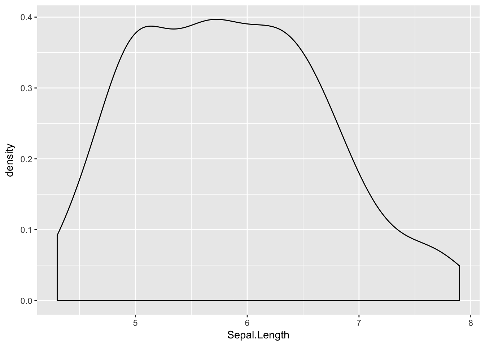
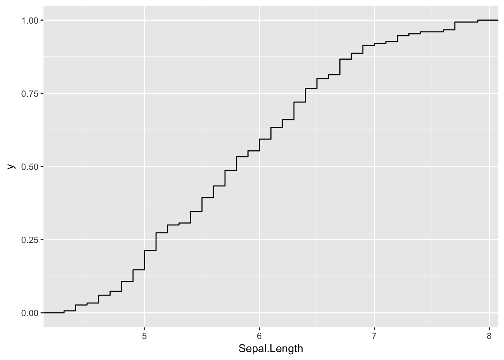
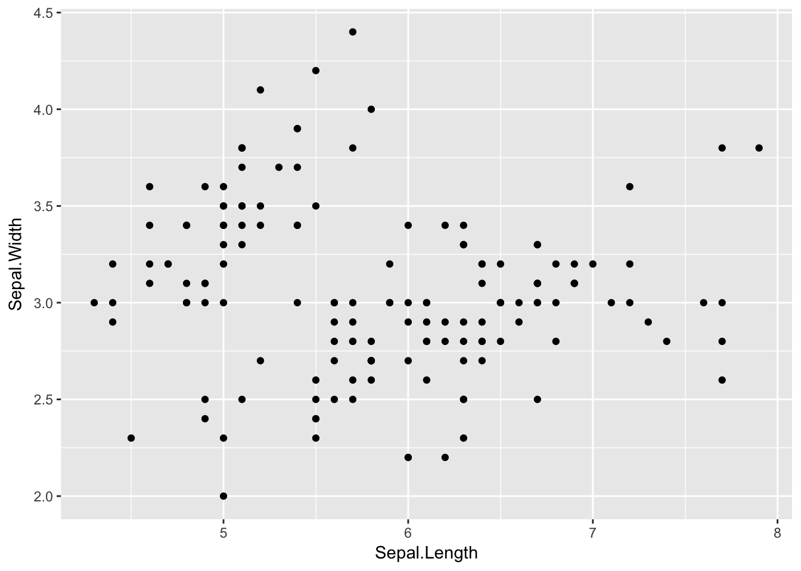
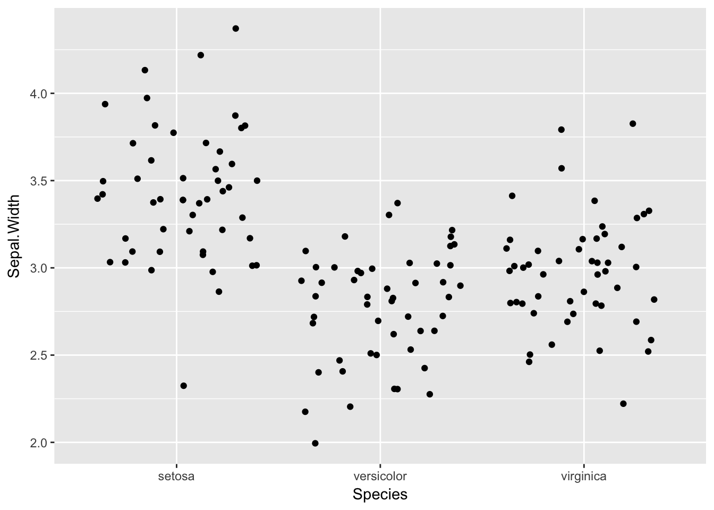
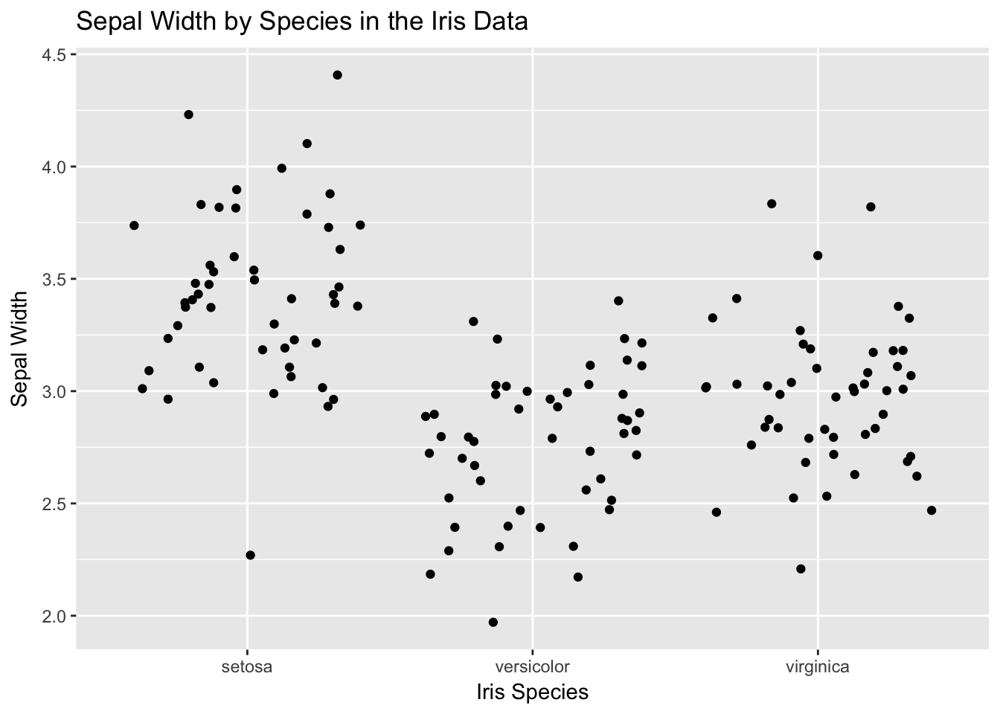

# Graphs

In our classes we primarily use the ggplot2 package for graphing.

Remember htat you will need to load the package `library(ggplot2)`. 

As a package is is very flexible and provides many options that will let you do just about any visualization,
but this can make it seem complicated when you are starting out learning it.

## How ggplot works

Ggplot constructs a graph by building it up piece by piece, with the parts connected with `+` signs.

### ggplot()

A ggplot always starts with the `ggplot()` function.  For beginners, the important thing to know is that this
function sets up the axes for your plot.  To do this you n provide the name of the data set
and the name of the x variable and the y variable (if needed). Notice how the three axes below differ
depending on how many variables there are and what kind of variable they are.  The variable information
goes inside the `aes()` which is short for aesthetics.  


```r
library(ggplot2)

ggplot(iris, aes(x = Sepal.Length)) 
```


```r
ggplot(iris, aes(x = Sepal.Length, y = Sepal.Width))
```


```r
ggplot(iris, aes(x = Species, y = Sepal.Width))
```


### Adding geom 
To add data to the axes you use a "geom" that determines the type of display.  The geom does not modify the
axis, it adds data to it. To show this, let's save the ggplot information and add to it.

Our first example is only for one variable.  Often, you will want to add options such as binwidth.
The last example shows how to use a slightly different approach to graph the cumulative distribution (ecdf).


```r
graph1 <- ggplot(iris, aes(x = Sepal.Length))  
graph1 + geom_histogram()
```

```
## `stat_bin()` using `bins = 30`. Pick better value with `binwidth`.
```


```r
graph1 + geom_dotplot(binwidth = .1)
```


```r
graph1 + geom_bar()
```


```r
graph1 + geom_density()
```



```r
graph1 + stat_ecdf(geom = "step")
```



Our second example uses two interval variables, so has different possibilities than the first. 
The second one shows one way that geoms can be combined.


```r
graph2 <- ggplot(iris, aes(x = Sepal.Length, y = Sepal.Width))

graph2 + geom_point()
```



```r
graph2 + geom_point() + geom_smooth()
```

```
## `geom_smooth()` using method = 'loess'
```


```r
graph2_with_species <- ggplot(iris, aes(x = Sepal.Length, y = Sepal.Width, color = Species)) + geom_point()
graph2_with_species
```


This data includes two types of data.  The last example shows how multiple geoms can be combined.


```r
graph3 <- ggplot(iris, aes(x = Species, y = Sepal.Width))

graph3 + geom_point()
```


```r
graph3 + geom_count()
```


```r
graph3 + geom_jitter()
```



```r
graph3 + geom_boxplot()
```


```r
graph3 + geom_boxplot() + geom_jitter()
```


### Add titles and labels, modify axes

There are many additional options that you can use. This document will just show how to add a title
and labels and modify axes.

```r
graph3 + geom_jitter() +
        ggtitle("Sepal Width by Species in the Iris Data") +
        labs(y="Sepal Width", x="Iris Species")  
```



The way to modify axes is to use `scale_y_continuous` and `scale_x_continuous`.  These are very flexible and 
have many options. This section will show how to change or improve some of the previous plots.


```r
# Remove irrelevant y axis values
graph1 + geom_dotplot(binwidth = .1) +
         scale_y_continuous(NULL, breaks = NULL)
```


```r
# Use the same tick marks on the x axis match those on the y axis
graph2 + geom_point() + scale_x_continuous( breaks = seq(4, 8, .5), minor_breaks = waiver())
```


 There are several websites that give detailed examples of more complex ways to create visualizations. 

## Common problems

Some of the most common problems in ggplot are the same as any other code in R, misspelling names, using 
the wrong graph for your data type, or having a problem with your tick marks. 

Here are some errors that you are most likely to see when using ggplot.

### unexpected symbol

This happens when you forget to put a `+` between the different parts of your plot.
```r
graph3  geom_jitter()
Error: unexpected symbol in "graph3  geom_jitter"
```

### invalid argument to unary operator

This happens if you have an extra `+`.

```r
 graph3 + + geom_jitter()
Error in +geom_jitter() : invalid argument to unary operator
```
### Error: unexpected ')' 

This happens if you have an extra closing parenthesis.

```r
graph2 <- ggplot(iris, aes(x = Sepal.Length, y = Sepal.Width)))
Error: unexpected ')' in "graph2 <- ggplot(iris, aes(x = Sepal.Length, y = Sepal.Width)))"

```


